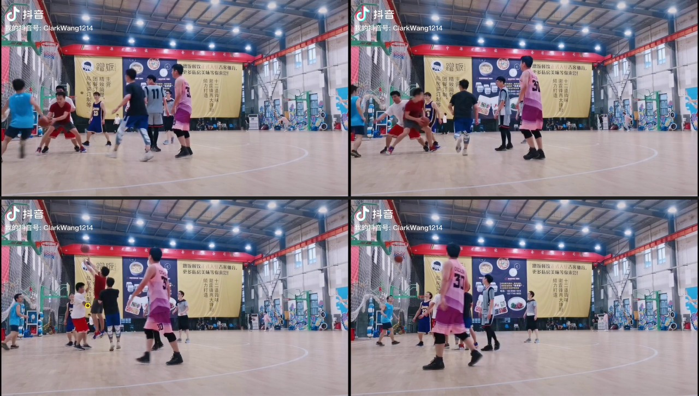

# Basketball Highlights

> 篮球进球集锦自动剪辑器——三脚架录制的比赛视频丢进去，自动输出进球集锦。

## 背景

打篮球半场 3V3 的时候，习惯在旁边架三脚架用手机录全场。赛后想剪进球集锦——得手动拖到每个进球附近、剪出来、拼一起。这事机械又耗时。

市面上有运动相机（Hudl 之类）能做自动集锦+数据统计，但设备贵、平台封闭、自由度低。作为篮球爱好者和程序员，自然想到：**能不能用多模态 AI + 一点 CV，自己 vibe 一个出来？**

正好之前在折腾小米 Mimo v2.5 模型做图片理解（[mcp-mimo-vision](https://github.com/ClarkWang1214/mcp-mimo-vision)），发现它支持视频输入。核心问题就一个——Mimo 能不能从篮球视频里认出"进球了"并告诉你第几秒？

验证通过后，整个项目在一次 [brainstorming session](docs/) 中逐步成型，最终形成了 VLM 决策 + CV 验证的三阶段协作架构。

## 设计思路

篮球进球检测这个任务，**VLM 和 CV 各自只擅长一半**：

| | VLM (Mimo v2.5) | CV (YOLO + OpenCV) |
|------|------|------|
| **擅长的** | 语义理解——"这是进球"、"跳投还是上篮" | 客观测量——球员在哪、穿什么颜色、怎么移动 |
| **不擅长的** | 精确颜色判断 (~50%)、确定性输出（同一视频 6-17 球波动） | 不理解篮球规则，"球穿过篮筐"和"球砸框弹出"在低帧率下轨迹相似 |
| **成本** | API 按量计费 (~64K tokens/场) | 零（纯本地 CPU） |

所以让它们打配合：

- **Phase A**（VLM 扫描）：全视频低帧率过一遍 Mimo，输出进球时间戳列表
- **Phase B**（VLM 精细识别）：每个进球截取高帧率短片段，Mimo 分析球衣颜色/号码/投篮类型
- **Phase C**（CV 交叉验证）：YOLOv8 检测+ByteTrack 跟踪+HSV 取色，客观检测场上所有球员颜色，与 Mimo 的描述做匹配验证——Mimo 说"红色球员得分"，CV 确认场上确实有红色球员，✅ 交叉验证通过

> 当前版本验证了完整链路可跑通。已知核心问题是 Mimo 召回率波动（非确定性），根本解决方案见 [TODO](#p0-架构修正)——用 CV 多信号融合做候选发现，Mimo 只做精判。这也是设计文档中真正的 Approach B。

## 效果演示

<p align="center">
  
</p>

> Mimo v2.5 从视频中识别到的单次进球全过程——左上→右上：组织进攻；左下：投篮出手最高点；右下：球接近篮筐。

## 快速开始

```bash
# 1. 安装依赖
pip install openai ultralytics supervision opencv-python

# 2. 设置 API Key (https://platform.xiaomimimo.com/console/api-keys)
export MIMO_API_KEY=sk-xxx

# 3. 准备视频——三脚架固定机位录制的半场 3V3 比赛 mp4 文件

# 4. 基础模式 (VLM 检测 + 精细识别)
python highlight.py game.mp4 -o highlights.mp4

# 5. 全模式 (+ CV 球员跟踪交叉验证)
python highlight.py game.mp4 -o highlights.mp4 --track
```

首次运行时 YOLOv8n 模型权重 (6.2MB) 会自动下载。测试视频 (`video.mp4`) 和生成的集锦不包含在仓库中——放你自己的比赛视频即可。

## 整体架构

```
video.mp4
    │
    ▼
┌──────────────────────────────────────────┐
│ Phase A: VLM 进球检测                      │
│ Mimo v2.5 全视频低帧率扫描 (fps=3)          │
│ Prompt: "找出所有进球，返回 JSON"            │
│ 输出: [{time_sec, description}]            │
└──────────────────────────────────────────┘
    │ 进球时间戳列表
    ▼
┌──────────────────────────────────────────┐
│ Phase B: VLM 精细识别                      │
│ 每个进球截取 4s 高帧率片段 (fps=6)          │
│ Mimo 分析: 球衣颜色/号码/2分3分/投篮动作     │
└──────────────────────────────────────────┘
    │ 球员描述 + 球衣颜色
    ▼
┌──────────────────────────────────────────┐
│ Phase C: CV 球员跟踪 (可选, --track)       │
│ YOLOv8n → ByteTrack → HSV 取色             │
│ 交叉验证: Mimo说"红色得分" → CV确认红色球员   │
│ 成本: ¥0, 纯本地 CPU                        │
└──────────────────────────────────────────┘
    │ 验证后的进球数据
    ▼
┌──────────────────────────────────────────┐
│ ffmpeg 剪辑 + 拼接                         │
│ 裁剪 ±5s/+3s → 去重叠 → concat            │
│ 输出: highlights.mp4 + video_goals.json   │
└──────────────────────────────────────────┘
```

### 为什么 VLM + CV 协作

| | VLM (Mimo v2.5) | CV (YOLO + ByteTrack) |
|---|---|---|
| **擅长的** | 语义理解——"这是进球"、"跳投" | 客观测量——位置、轨迹、颜色 |
| **不擅长的** | 精确颜色、确定性输出 | 不理解"进球"是什么 |
| **成本** | API 按量计费 (~0.03元/球) | 零（纯本地 CPU） |
| **角色** | 决策者——发生了什么 | 验证者——谁做的、穿什么 |

## 参数

| 参数 | 默认值 | 说明 |
|------|--------|------|
| `-o, --output` | `<input>_highlights.mp4` | 输出文件路径 |
| `--before` | 5.0 | 进球前截取秒数 |
| `--after` | 3.0 | 进球后截取秒数 |
| `--fps` | 3 | Phase A 抽帧率 (0.1-10) |
| `--refine-fps` | 6 | Phase B 精细分析抽帧率 |
| `--no-refine` | - | 跳过 Phase B |
| `--track` | - | 启用 Phase C CV 球员跟踪 |
| `--merge` | -1 | 合并间距 < N 秒的片段 (-1 不合并) |
| `--no-concat` | - | 只裁剪不拼接 |
| `--max-tokens` | 8192 | Phase A 最大输出 token |

## 输出

| 文件 | 说明 |
|------|------|
| `highlights.mp4` | 最终进球集锦 |
| `video_goals.json` | 结构化进球数据（含球员信息、CV 验证结果） |
| `video_clips/` | 各进球片段（中间产物） |

### video_goals.json 示例

```json
{
  "goals": [
    {
      "time_sec": 15,
      "jersey_color": "红色",
      "shot_type": "2分跳投",
      "action": "跳投",
      "scorer_desc": "红色球衣球员，中距离跳投",
      "cv_scorer_color": "红色",
      "cv_all_colors": ["白色", "红色", "蓝色"],
      "cv_match": "✅"
    }
  ],
  "total_goals": 8
}
```

## 技术细节

### Mimo API 调用要点
- 使用 OpenAI SDK 兼容接口，base64 编码视频 (`data:video/mp4;base64,...`)
- **必须禁用 thinking**：`extra_body={"thinking": {"type": "disabled"}}`，否则推理过程会吃掉全部输出 token 导致实际回复为空
- Prompt 要求 JSON 格式返回，程序直接解析
- Phase B 短片段缓存命中率 90%+，边际成本极低

### CV 球员跟踪
- **检测**: YOLOv8n (6.2MB), person class, conf > 0.35
- **跟踪**: ByteTrack, 帧间 IoU + 外观特征
- **取色**: HSV 颜色范围匹配。取球员 bbox 上半身中心区域，排除肤色和阴影，与 7 种预设颜色（红/橙/黄/绿/蓝/紫/白）做掩膜匹配

## 已知局限 & TODO

当前实现已验证核心流程可跑通，但有几个明确问题待解决。完整讨论见 [设计文档](docs/)。

### P0: 架构修正
- [ ] **篮网运动检测** — ROI + 光流检测进球物理信号（几乎零误报）
- [ ] **音频峰值检测** — librosa 提取进球叫好声/swish 声（免费高精度信号）
- [ ] **CV 候选 + VLM 精判** — CV 多信号融合做候选发现（确定性高召回），Mimo 只做精判确认。解决当前 Mimo 非确定性（同一视频 6-17 球波动）的根本方案

### P1: 球员分析增强
- [ ] **骨骼姿态识别** — MediaPipe Pose，投篮动作检测 + 庆祝姿态识别
- [ ] **投篮者识别改进** — 结合球轨迹 + 姿态 + 空间位置，替代启发式猜

### P2: 工程打磨
- [ ] **Track 碎片化管理** — 合并 ByteTrack 碎片化 ID
- [ ] **3 分线检测** — 用户标注三分线端点，精确判断 2 分/3 分
- [ ] **真实比赛验证** — 在 30 分钟原始比赛录像上端到端测试
- [ ] **输出增强** — 集锦加字幕、球员信息条、可选配乐

### P3: 远期
- [ ] **实时模式** — 边录边剪
- [ ] **球员数据统计** — 基于 track 的命中数、投篮分布、得分热力图

## 文件结构

```
basketball-highlight/
├── README.md
├── LICENSE
├── .gitignore
├── docs/                     # 完整设计文档
├── assets/                   # 示意图
│   ├── storyboard.jpg        #   2x2 帧序列：进攻→出手→球近框
│   ├── build_up.jpg
│   ├── shot_action.jpg
│   └── after_score.jpg
├── highlight.py              # 主 pipeline (Phase A+B+C)
├── player_tracker.py         # CV 球员跟踪模块 (Phase C)
└── test_mimo_video.py        # Mimo 视频能力验证脚本
```

## 参考

- [Mimo v2.5 视频理解文档](https://platform.xiaomimimo.com/docs/zh-CN/usage-guide/multimodal-understanding/video-understanding)
- [Mimo 按量计费](https://platform.xiaomimimo.com/docs/zh-CN/price/pay-as-you-go)
- [YOLOv8 / Ultralytics](https://docs.ultralytics.com)
- [ByteTrack (supervision)](https://supervision.roboflow.com/latest/trackers)
